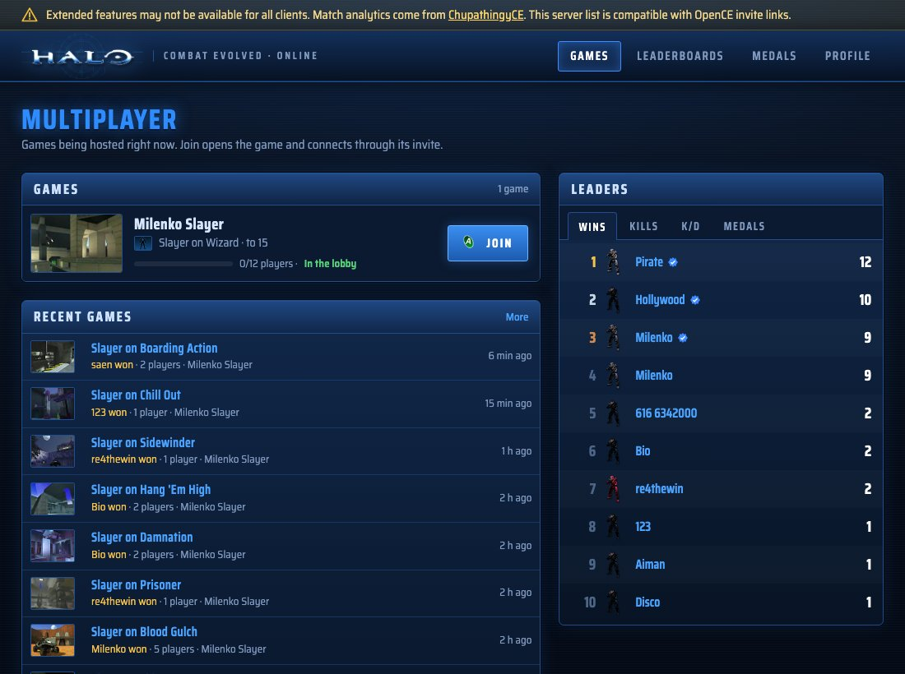

# Halo in the browser and on every platform (FractumSeraph's fork)

This fork is [ChupathingyCE](https://github.com/ChupathingyCE/chupathingyce)
(a community build of [OpenCE](https://github.com/OpenCommunityEdition/OpenCE),
with its dedicated servers and the Delta network family), kept up to date with
both, with a browser version added: the same game compiled to WebAssembly,
playable in Chrome, Edge, Firefox and on phones, online with other browsers
and with the native builds of ChupathingyCE and OpenCE. The browser port comes
from [web-halo](https://github.com/ecumene/web-halo). It runs at
[halo.fractumseraph.net](https://halo.fractumseraph.net/).

Where ChupathingyCE and OpenCE differ, ChupathingyCE's code is this fork's;
this fork's own features are added on top of it.

## Download

**The game for Windows, Mac, Linux and Android**, this fork's builds of the
latest `main` (each push that builds on every platform is a release,
`v<version>-fs.<run>`; the game updates itself from these releases). At the
first start it offers to download the game's maps (see
[Game data](#game-data)), and it downloads Custom Edition maps as a game
needs them ([docs/map_torrents.md](docs/map_torrents.md)):

| Platform | Release | Debug |
| --- | --- | --- |
| Windows (64-bit) | [chupathingyce-windows64-release.zip](https://github.com/FractumSeraph/OpenCE/releases/latest/download/chupathingyce-windows64-release.zip) | [chupathingyce-windows64-debug.zip](https://github.com/FractumSeraph/OpenCE/releases/latest/download/chupathingyce-windows64-debug.zip) |
| Windows (32-bit) | [chupathingyce-windows-release.zip](https://github.com/FractumSeraph/OpenCE/releases/latest/download/chupathingyce-windows-release.zip) | [chupathingyce-windows-debug.zip](https://github.com/FractumSeraph/OpenCE/releases/latest/download/chupathingyce-windows-debug.zip) |
| Linux (64-bit) | [chupathingyce-linux64-release.zip](https://github.com/FractumSeraph/OpenCE/releases/latest/download/chupathingyce-linux64-release.zip) | [chupathingyce-linux64-debug.zip](https://github.com/FractumSeraph/OpenCE/releases/latest/download/chupathingyce-linux64-debug.zip) |
| Linux (32-bit) | [chupathingyce-linux-release.zip](https://github.com/FractumSeraph/OpenCE/releases/latest/download/chupathingyce-linux-release.zip) | [chupathingyce-linux-debug.zip](https://github.com/FractumSeraph/OpenCE/releases/latest/download/chupathingyce-linux-debug.zip) |
| Mac | [chupathingyce-macos-release.zip](https://github.com/FractumSeraph/OpenCE/releases/latest/download/chupathingyce-macos-release.zip) | [chupathingyce-macos-debug.zip](https://github.com/FractumSeraph/OpenCE/releases/latest/download/chupathingyce-macos-debug.zip) |
| Android | [chupathingyce-android-release.zip](https://github.com/FractumSeraph/OpenCE/releases/latest/download/chupathingyce-android-release.zip) | [chupathingyce-android-debug.zip](https://github.com/FractumSeraph/OpenCE/releases/latest/download/chupathingyce-android-debug.zip) |
| Dedicated server (Linux x64) | [chupathingyce-server-linux-x64.zip](https://github.com/FractumSeraph/OpenCE/releases/latest/download/chupathingyce-server-linux-x64.zip) | |

(The Android app of these releases is unsigned, as ChupathingyCE's pull
requests' are: ChupathingyCE signs only its own releases.)

**The browser version, to host it yourself** (no game data included):

| File | What it is |
| --- | --- |
| [halo-server.zip](https://github.com/FractumSeraph/OpenCE/releases/download/web-latest/halo-server.zip) | Everything to host it: the game, its server, the lobby service for online play, the gateway for native `halo://join` links, and Node.js, for Windows and Linux x64 in one folder you can copy between them. Unzip, put the game's Xbox `.map` files in `halo-server/public/assets/maps/`, and double-click `Start Halo (Windows).bat` (or run `./start-halo.sh`). On Windows, `server\windows\update.ps1` later updates the folder in place. |
| [halo-server-windows-x64.zip](https://github.com/FractumSeraph/OpenCE/releases/download/web-latest/halo-server-windows-x64.zip) | The same for Windows only (smaller). |
| [halo-server-linux-x64.zip](https://github.com/FractumSeraph/OpenCE/releases/download/web-latest/halo-server-linux-x64.zip) | The same for Linux x64 only. [HOSTING-VPS.md](services/selfhost/HOSTING-VPS.md) sets it up on a VPS with your own domain and HTTPS; [HOSTING-STATIC.md](services/selfhost/HOSTING-STATIC.md) puts the page on a web host of its own. |
| [halo-web.zip](https://github.com/FractumSeraph/OpenCE/releases/download/web-latest/halo-web.zip) | The game alone, to put on any web server. Without the lobby service there is no online play. |

The kits' instructions: [services/selfhost/README.md](services/selfhost/README.md).

## Game data

At the first start the game offers to download its `maps/` folder (about
1.8 GB) from this fork's site, https://halo.fractumseraph.net/assets/maps/
(the setting `data.download_url`; empty turns it off), or to extract it from
an Xbox disc image of Halo: Combat Evolved, as ChupathingyCE's builds do (see
"You need your own copy of Halo" below). On Android the launcher has a
**Download the maps** button.

## What this fork adds to ChupathingyCE

- **The browser build** (`ninja web`, `tools/web_build.py`, `port/web`): the
  game in WebAssembly with WebGL 2, the page and its online play (rooms,
  invites, quick games, joining native hosts through the native gateway),
  touch controls, installing as an app, Custom Edition maps served by the
  site, maps kept in the browser, voice chat, and ChupathingyCE's Delta
  (Delta List, Delta Peer and Delta Stats) through the site's relay. Its
  details are in [Browser build](#browser-build) at the end.
- **Online services** (`services/`): the lobby service for browser games
  (`services/signaling`), the native gateway that lets a browser join a
  native `halo://join` invite (`services/native-gateway`, Rust), and the
  self-hosting server and its kits (`services/selfhost`).
- **Custom Edition maps over BitTorrent** in the native builds
  (`port/linux/src/torrent*.c`, `map_torrents.c`, [docs/map_torrents.md](docs/map_torrents.md)):
  a map missing when joining (`cache_files_map_present`, ChupathingyCE's
  check) is downloaded from other players, this fork's seed box and web
  seed (http://halomaps.fractumseraph.net/maps/) and tracker
  (halovps.fractumseraph.net:6969), and a hosted map is seeded.
- **The maps downloaded at the first start** (`sdl_platform.c`,
  `LauncherActivity.java`; `data.download_url`).
- **Voice chat** (OpenCE's, with the Opus codec built into every port).
- **This fork's MQTT broker**, `halovps.fractumseraph.net:1883`, first in
  `brokers.txt`, and the game's broker limit raised from 4 to 5 for it.
- **Releases and updates of its own**: every push to `main` that builds is a
  release of this repository (`.github/workflows/build.yml`'s release job),
  and its builds update from them (`HALO_UPDATE_REPOSITORY`,
  `tools/ci_build.py`).
- **A workflow for the browser build** (`.github/workflows/web.yml`): it
  builds the page and the self-hosting kits and puts them on the
  `web-latest` release.

Browser-only code is inside `#ifdef HALO_WEB` (or in files only the browser
build compiles); nothing sent over the network is changed.

---

<p align="center"></p>

<h1 align="center">ChupathingyCE</h1>

<p align="center"><b>Halo: Combat Evolved on Windows, Mac, Linux and Android: a community build of OpenCE, with its own releases, dedicated servers and the Delta network family.</b></p>

<p align="center">
<a href="https://github.com/ChupathingyCE/chupathingyce/releases/latest">Download</a> ·
<a href="https://halo.milenko.org">Games online now</a> ·
<a href="https://discord.gg/4BUm2FwuCB">Discord</a>
</p>

> **Compatible with [OpenCE](https://github.com/OpenCommunityEdition/OpenCE) build-149 through build-167 (network version 24).** OpenCE build-149 through build-167 players join our games, and our builds join games hosted on network versions 11 through 24 (OpenCE build-76 through build-167). Games hosted on older builds (network version 10) can't be joined; their hosts need to update.
> Players on OpenCE and players on ChupathingyCE play together.

ChupathingyCE is a community build of **OpenCE**, the port of the Halo: Combat
Evolved decompilation to modern computers and phones. Our goal is a unified
online experience, plus our own tweaks, on a project that's still in its
infancy. We stay compatible with OpenCE, offer our fixes back to it, and put
out our own releases. Expect rough edges, and please report them.

<p align="center"></p>

## Features

**Online**
- **Online Games**, a server list in the Multiplayer menu: join a game with **A**, or host one with **Y**
- Games you host are listed for everyone, from any of our builds
- Invite links (`halo://join/…`) to send to friends; opening one joins their game
- Direct connections between players, with no port forwarding in most homes
- Plays with OpenCE builds of the same network version, both ways
- Dedicated servers anyone can run: a playlist of games, around the clock, on Linux x86, x64 or arm64

**Stats, on [halo.milenko.org](https://halo.milenko.org)**
- A carnage report for every finished game, with medals
- Service records and leaderboards, with confirmed players (your games count toward you, whatever name you use)
- Accounts, made on the site or from the game, with an encrypted backup of your player identity
- Listing a game hosted from an OpenCE build, by its invite link

**The game**
- The campaign, split screen and System Link, running natively (no emulator)
- High-res HUD and text, and widescreen menus
- Controller prompts for Xbox, PlayStation and Nintendo pads, and the keyboard
- Updates itself: it checks for new releases when it starts, and asks first

**Platforms**

| | Windows | Mac | Linux | Android |
| --- | --- | --- | --- | --- |
| The game | Yes | Yes, Apple silicon and Intel | Yes | Yes |
| Online Games, hosting, stats | Yes | Yes | Yes | Yes |
| Dedicated server | The game, for a test | The game, for a test | Yes: x86, x64 and arm64, and Docker | |
| Updates itself | Yes | Not yet | Yes | Yes |
| Halo PC (Custom Edition) maps | Yes | Yes | Yes | Yes, see below |
| HaloMD maps | Yes | Yes | Yes | Yes, see below |
| Server Browser in the PC menus | Yes | Yes | Yes | Yes |

## Download

Get the latest release from the [Releases page](https://github.com/ChupathingyCE/chupathingyce/releases/latest):

| Platform | Download | Notes |
| --- | --- | --- |
| Windows | `chupathingyce-windows-release.zip` | Windows 10 or later. |
| Linux (64-bit) | `chupathingyce-linux64-release.zip` | Needs SDL3. See [port/linux/README.md](port/linux/README.md). |
| Linux (32-bit, older systems) | `chupathingyce-linux-release.zip` | Needs SDL3 (32-bit). See [port/linux/README.md](port/linux/README.md). |
| Android | `chupathingyce-android-release.zip` | Android 9 or later, 64-bit. See [port/android/README.md](port/android/README.md). |
| Mac | `chupathingyce-macos-release.zip` | macOS 13 or later, Apple silicon or Intel. |

The game checks for new releases when it starts and asks before updating.

We don't pay for code signing yet, so the first start needs one extra step:

- **Windows** may warn about an unknown publisher: choose **More info → Run anyway**.
- **Mac**: move ChupathingyCE to Applications and open it. If macOS won't open
  it, go to **System Settings → Privacy & Security**, and choose **Open
  Anyway** next to ChupathingyCE. You only do this once.

## You need your own copy of Halo

ChupathingyCE doesn't include the game's maps, sounds or art. You need an Xbox
disc image (`.iso` or `.xiso`) of Halo: Combat Evolved. Any region works.

1. Start ChupathingyCE.
2. The first time, it asks for your disc image. Pick it.
3. It copies the game's `maps` folder out of the image (about 2 GB), then starts.

On Android, copy the disc image to your phone first; the maps, settings and
saves go in `/sdcard/Android/data/dev.horrible.chupathingyce/files`. On a
Mac, the maps, settings and saves go in
`~/Library/Application Support/ChupathingyCE`.
On Linux, the maps and settings (`config.toml`) go next to the `halo`
executable, and the saves in `~/.local/share/halo-linux` (or
`$XDG_DATA_HOME/halo-linux`). The 64-bit and 32-bit builds use the same
places, so switching from one to the other keeps your saves and settings.

**Common mistake:** the `maps` folder must hold the Xbox maps from your disc
image, not Halo PC's. Halo PC maps go in folders of their own beside it:
`maps_ce`, `maps_md` and `maps_pc` (see below). On a Mac, Linux and
Windows, if `maps` holds Halo PC maps or has no `ui.map`, the game says so
and quits.

## Halo PC maps

Every ChupathingyCE build also plays Halo PC multiplayer maps: Windows
(32-bit and 64-bit), Mac, Linux (32-bit and 64-bit), Android and the
dedicated server. Each kind has a folder of its own beside the game's
`maps` folder:

| Folder | What goes in it | Played online as |
| --- | --- | --- |
| `maps_ce` | Halo PC Custom Edition maps, with Custom Edition's `bitmaps.map`, `sounds.map` and `loc.map` | `<name>@ce` |
| `maps_md` | HaloMD maps (below) | `<name>@md` |
| `maps_pc` | the maps of your own Halo PC (retail) disc | `<name>@pc` |

Where the game's `maps` folder is:

| Platform | The folder holding `maps`, `maps_ce`, `maps_md` and `maps_pc` |
| --- | --- |
| Mac | `~/Library/Application Support/ChupathingyCE/` |
| Linux | next to the `halo` executable |
| Windows | next to `halo.exe` |
| Android | `/sdcard/Android/data/dev.horrible.chupathingyce/files` |

Copy the `.map` files from your own Halo PC install. Include `bitmaps.map`,
`sounds.map` and `loc.map` from Custom Edition in `maps_ce`: every Halo PC
map reads them. Halo PC's own `ui.map` there adds its map names and
pictures. The maps appear in the multiplayer map list after the Xbox maps,
marked [CE], [MD] or [PC]. In Online Games, a game on a Halo PC map is
badged, and it can be joined only by players who have that map: the game
says which file is missing and where it goes. The Xbox maps from your disc
image are still needed. ChupathingyCE doesn't come with any of these files.

**Playing with OpenCE players.** OpenCE (build-147) plays Custom Edition
maps from its `custom_maps` folder. A game on a Custom Edition map is named
the same way for both, so OpenCE players with the map join our games and we
join theirs. HaloMD and Halo PC retail games are ChupathingyCE's only: an
OpenCE player is told the map is missing. Between ChupathingyCE players,
the map's identity (its name and a hash of its file) is checked, so a
player with a different file of the same name is told so.

**Older folders.** Earlier ChupathingyCE versions kept Custom Edition maps
in `maps/ce/` and HaloMD maps in `md_maps/`, and OpenCE keeps its Custom
Edition maps in `custom_maps/`. The game still plays the maps in all three.
At its first start it offers to move `maps/ce/` to `maps_ce` and `md_maps/`
to `maps_md` (each folder is moved whole: nothing is copied or deleted, and
a folder that can't be moved stays where it is). `custom_maps/` is OpenCE's
and stays where it is. `game.move_old_map_folders` in `config.toml` says
`"ask"`, `"yes"` or `"no"`; Android moves them without asking. A map file
named `<name>@ce.map` (`@md`, `@pc`), as some other builds name them, is
found in its folder or in `maps/` itself.

**Common mistake:** don't point `maps` itself at a Halo PC maps folder, or copy
Halo PC maps straight into it. The game can't start with Halo PC's `ui.map`
in place of the Xbox one, and Halo PC maps in `maps/` itself don't play. Keep
the Xbox maps in `maps/` and the Halo PC maps in `maps_ce`, `maps_md` or
`maps_pc`.

On Android, two limits apply. The maps need a fixed 23 MB of the app's
memory, which Android's Java runtime takes on some devices with a very large
Java heap (more than about 700 MB, such as some gaming handhelds). There
the Halo PC maps are not listed, and the log says `cannot reserve Custom
Edition maps' tag cache`. And the phone's texture cache is smaller than a
computer's, so on the heaviest maps (Foundation) some surfaces can show the
wrong textures in their busiest views. See [port/android/README.md](port/android/README.md).

### HaloMD maps

ChupathingyCE also plays HaloMD's multiplayer maps (the Mac Halo community's
maps, made for Halo PC 1.0), in every build. Bring your own: download
the maps you want from HaloMD's mod list, and put their `.map` files in
`maps_md`, beside the game's `maps` folder.

They need Custom Edition's `bitmaps.map`, `sounds.map` and `loc.map` in
`maps_ce` too: a HaloMD map keeps Halo's own textures and sounds in those
shared files, and the game reads them from Custom Edition's copies.

The maps appear in the multiplayer map list after the Halo PC maps, marked
[MD], with their names from HaloMD's list. Online, a HaloMD map is played as
`<name>@md` (`bgplus_5@md`), badged HALOMD in Online Games, and joined only by
players who have the same map file.

HaloMD's plug-ins aren't part of ChupathingyCE. A few maps were made for one:
the visible-object and bigger-BSP limits they raised are already raised here,
and the widescreen view is the game's own, but the maps made for gameplay
plug-ins (3rd Person, Rocket Surfing, Spartan) play without them, as plain
Halo.

## Playing online

| You want to | Do this |
| --- | --- |
| Join a game | **Multiplayer → Online Games**, pick a game, press **A**. Or press **Join** on [halo.milenko.org](https://halo.milenko.org). |
| Host a game | **Multiplayer → Online Games → Y (Create Game)**, or host from System Link as usual. Your game is listed online by itself, on halo.milenko.org and in OpenCE's in-game Server Browser (`public_lobby`/`host_public` under `[network]` in `config.toml` turn that off). |
| Invite a friend | When you host, the game copies an invite link (`halo://join/…`). Send it; opening it joins your game. |
| See your stats | Your service record is on [halo.milenko.org](https://halo.milenko.org), found by your name. Games you join count even when the host doesn't run ChupathingyCE: when an online game you joined ends, the game sends halo.milenko.org the scoreboard as your game saw it (names, kills, deaths, scores, medals, weapons) with your player ID. Your copy also confirms your line in the host's report, which puts the game on your profile. To turn both off for games you join, set `report_joined_games = false` under `[network]` in `config.toml`. |
| Stop sharing your hosted games' stats | Set `report_events = false` under `[network]` in `config.toml`. It's on by default: the games you host send their Delta Stats (kills with positions, accuracy, medals, objectives) to halo.milenko.org for its match pages and heatmaps. Never anyone's address. |
| Make an account | On [halo.milenko.org/profile](https://halo.milenko.org/profile), or press **Start** in Online Games to make one for the player you already are. |
| Link the game without a browser (Steam Deck, Game Mode) | In Online Games, press **RB** (or **C** on the keyboard) for Link Profile. On your phone or computer, go to [halo.milenko.org/connect](https://halo.milenko.org/connect), enter the code the game shows (or scan its QR code), then press **A** in the game to confirm. |
| Use the PC menus | Set `menus = "pc"` under `[display]` in `config.toml`. **Multiplayer → Join Game → Server Browser** lists OpenCE's public games and the games of halo.milenko.org, each once. |
| List a game from an OpenCE build | Sign in on the site, open **Host a Game**, and paste your invite link. |

Everything here plays with OpenCE builds of the same network version: they can
join your games and you can join theirs. Games an OpenCE build hosts are
recorded from the reports of the ChupathingyCE players in them; a game only
one player reported counts only on that player's own record. Games hosted from OpenCE builds can still be listed by
their host on the site (Host a Game).

<p align="center">


</p>

## Settings (config.toml)

Most of what you can change lives in the game's menus, but everything the
port adds is in one file, `config.toml`. The game writes it the first time it
starts, with every setting listed, commented out at its default, and a line
or two saying what each one does. To change one, remove the `#` in front of it
and edit the value; the game reads the file when it starts, so restart it
after a change. If a change seems to do nothing, look in `debug.txt` for lines
starting `config.toml` or `settings:`: they name a misspelled setting, one in
the wrong `[section]`, a value missing its quotes (`menus = "pc"`, not
`menus = pc`, which leaves every setting at its default), or, on a Mac, a
`config.toml` that is not the one the game reads.

| Platform | config.toml is |
| --- | --- |
| Windows | next to `halo.exe` |
| Mac | `~/Library/Application Support/ChupathingyCE/config.toml` |
| Linux and Steam Deck | next to the `halo` executable |
| Android | in the game's data folder, `/sdcard/Android/data/dev.horrible.chupathingyce/files` |

A few people look for most:

| Setting | What it does |
| --- | --- |
| `display.mode` | `"fullscreen"`, `"borderless"` or `"windowed"`. F11 switches between a window and the whole screen. |
| `display.window_scale` | The window's size, as a multiple of 640x480. |
| `display.vsync`, `display.max_fps` | Vertical sync, and a frame rate cap (0 for none). |
| `display.menus` | `"xbox"` (the default) or `"pc"`, the Halo PC style menus with their Server Browser. |
| `display.player_names` | Names over players' heads: `"all"`, `"allies"`, `"enemies"` or `"none"`. |
| `audio.volume`, `audio.music_volume`, `audio.effects_volume` | Volumes, from 0.0 to 1.0. |
| `input.mouse_sensitivity`, `input.invert_mouse` | Mouse aim. |
| `controls.*` | Every key: `controls.jump = "Space"`, or two at once, such as `"F, Mouse 4"`. |
| `network.browser_url` | The game list Online Games shows (halo.milenko.org). |
| `network.host_public` | Whether games you host are listed for everyone (true) or only joinable by invite (false). |
| `update.auto` | Whether the game updates itself. |
| `paths.data`, `paths.saves` | Where the maps and the saves are, if not the usual place. |

Settings you leave at their default follow each new version's default, so
leaving the file alone is always safe. Every setting can also be given as an
environment variable for one run (the file lists each one's name), which
overrides the file.

## Run a server

The ChupathingyCE Dedicated Server hosts a playlist of games around the clock,
with no player of its own, and lists them on halo.milenko.org and in the
Server Browser. It is its own download for Linux on x86, x64 and arm64
(Oracle Cloud's free tier and Raspberry Pis included): one file, no libraries
to install, and no port forwarding. See [server/README.md](server/README.md).

## ChupathingyCE, OpenCE and Delta

ChupathingyCE is a fork of OpenCE with some extra features, meant to stay
compatible with it.

- **OpenCE** ([OpenCommunityEdition/OpenCE](https://github.com/OpenCommunityEdition/OpenCE))
  is the port ChupathingyCE started from. We merge its changes on our own
  schedule, and ChupathingyCE has its own releases and version numbers, so it
  doesn't change under you every few hours.
- **Playing together.** OpenCE players and ChupathingyCE players join each
  other's games. OpenCE raises its network version often, and its builds join
  only hosts of their exact number. ChupathingyCE follows those raises
  without a new download: a cross-play test runs against each new OpenCE
  build, and once it passes, a signed table tells existing ChupathingyCE
  builds which network versions to announce and join. A raise that changes
  how multiplayer plays still needs a ChupathingyCE release. The line at the
  top of this page says which OpenCE builds this release matches.
- **Delta** is ChupathingyCE's network family ([docs/delta.md](docs/delta.md)):
  the extras ChupathingyCE machines and services add on top of OpenCE's
  game protocol, such as the game list, stats, profile links and dedicated
  server admin tools on [halo.milenko.org](https://halo.milenko.org). Games
  with OpenCE players use OpenCE's protocol, so everyone plays together.
- Fixes to the shared game code are offered back to OpenCE as pull requests.

## Building it yourself

You need Python 3, [ninja](https://ninja-build.org/) and clang. The game
supplies the Xbox SDK declarations it uses, so you don't need the SDK.

```sh
python3 configure.py
ninja            # the game for the computer you're on
```

| Target | Result | Instructions |
| --- | --- | --- |
| `ninja macos` | `build/macos/ChupathingyCE.app` | [port/macos/README.md](port/macos/README.md) |
| `ninja linux64` | `build/linux64/halo` (64-bit) | [port/linux/README.md](port/linux/README.md) |
| `ninja linux` | `build/linux/halo` (32-bit) | [port/linux/README.md](port/linux/README.md) |
| `ninja windows` | `build/windows/halo.exe` | [port/windows/README.md](port/windows/README.md) |
| `ninja windows64` | `build/windows64/halo.exe`, the 64-bit game | [port/windows/README.md](port/windows/README.md#64-bit) |
| `ninja android_apk` | the Android app | [port/android/README.md](port/android/README.md) |
| `ninja server` | `build/server-<arch>/chupathingyce-server`, the dedicated server (Linux) | [server/docs/building.md](server/docs/building.md) |

Useful `configure.py` options:

| Option | What it does |
| --- | --- |
| `--release` | A release build, as players get. Without it, a failed check stops the game. |
| `--portable` | A Linux or Windows build that runs on any x86-64 computer, or a universal Mac application, to give to others. |
| `--no-game-browser` | Leaves out the server list, stats and dedicated servers, as OpenCE's builds are. |
| `--pgo=off`, `--lto=off` | Faster builds, without profile-guided or link-time optimisation. |
| `--profile` | A profiling build, which records where the game spends its time. See "Profiling builds" below. |

### Profiling builds

A profiling build records where the game spends its time, for
[Perfetto](https://ui.perfetto.dev/) and `tools/net_report.py`. The 32-bit
Linux and Windows builds and the Android app have one; the 64-bit builds,
the dedicated server and the browser build are built as without the option.

1. Enter `python configure.py --profile`, then build as usual (not with
   `--pgo=train`).
2. Start a recording: enter `profile_record` in the console (or the telnet
   console), or set `debug.profile_record = true` in `config.toml`. To
   record each game of a session, also set
   `debug.profile_record_when = "game"`.
3. Stop it: enter `profile_stop`, load another map, or quit.

| Command | Result |
| --- | --- |
| `profile_record [seconds]` | Starts a recording. With a number of seconds, it stops after that time. |
| `profile_stop` | Stops the recording. |

The game writes numbered `.part<n>.json` files under `profiles/` in its data
folder and logs their paths; they stay after the recording stops. Logs go to
standard error; a Windows release build without standard error writes them
to `halo.log` next to `halo.exe`. `python tools/net_report.py
<recording.part1.json>` reads a recording as tables, and writes
`<recording>.summary.txt`, a short text file.

`debug.profile_memory` sets a recording's memory in MB (default 256, from 4
to 1024). A recording has no length limit: the game writes a part each time
the memory is full. See the settings in
[port/linux/README.md](port/linux/README.md). On Android, the files are in
`/sdcard/Android/data/dev.horrible.chupathingyce/files/profiles/` (copy them with
`adb pull`). A profiling build plays with normal builds.

`python tools/ci_build.py linux profile` builds it as the GitHub workflow
does; the workflow builds it only in a run started by hand with its
`profile` box ticked.

The version being made is in `VERSION`. Releases are built and published by
the project's release workflow; the builds on this repository's Actions page
are for checking changes.

## Credits

- The decompilation: [punpckhdq/halo](https://github.com/punpckhdq/halo) and
  [bnunu/halo-1](https://github.com/bnunu/halo-1), of the Xbox build 2342.
- The port: [OpenCE](https://github.com/OpenCommunityEdition/OpenCE) and
  its contributors.
- ChupathingyCE: [Milenko](https://github.com/MrMilenko) and contributors. The
  icon is MrBruh's helmet, with tusks.
- Fonts: [Noto Sans](https://fonts.google.com/noto) (SIL OFL) and
  [Kenney's Input Prompts](https://kenney.nl/assets/input-prompts) (CC0).
- HaloMD map names: from [MacGamingMods](https://macgamingmods.com)' public
  HaloMD mod list, so the menus can show each map's own name.
- Libraries: SDL3, stb, Mbed TLS, miniupnpc, KCP, tomlc17, musl's maths,
  extract-xiso, Expat, Monocypher, zlib, SMAA, and Project Nayuki's QR Code
  generator. Their licenses are
  beside them in `port/third_party`.

### Contributors

Fixes from other people's OpenCE pull requests and forks, taken into
ChupathingyCE with their authors credited in each commit. What OpenCE has
merged itself, such as MrBruh's work, comes with OpenCE and is credited
there.

- [Tyberious](https://github.com/Tyberious) (Jeff Clark): Xbox ADPCM decoding
  without the 344 Hz buzz, vertex constant serials that never wrap, pose
  snapping for frame interpolation, and the clip-space position kept on the
  desktop (no more first-person vertex spikes).
- [thelinkin3000](https://github.com/thelinkin3000): the motion sensor for
  three and four local players (a split screen crash), and split screen
  dividers where the views meet on a wide screen.
- [xshxdex98](https://github.com/xshxdex98) ([DamnationCE](https://github.com/xshxdex98/DamnationCE)):
  the pause menu's QUIT by mouse or keyboard, and lens flares out of view no
  longer tested.
- [zimm3rmann](https://github.com/zimm3rmann): visibility test slot 0 kept
  apart from the scratch query (lens flares sharing a result).
- [nsafran1217](https://github.com/nsafran1217) (Nathan Safran): no hang
  where the visibility results buffer cannot be mapped.
- [saulob](https://github.com/saulob): the first menu frame's colors.
- [natsu-anon](https://github.com/natsu-anon): the cursor hidden during play.
- [lantos1618](https://github.com/lantos1618): no ghosting in the zoom effect
  at high resolutions; on macOS, Command-W does not quit and Command-Q asks
  twice.
- [pfista](https://github.com/pfista) (Michael Pfister): projectile trails
  ready before a weapon's first shot.
- [JoshRob297](https://github.com/JoshRob297): hosts that run their own games
  (the dedicated servers) no longer refuse every join after one arrived as a
  game ended.
- [HiIAmMoot](https://github.com/HiIAmMoot) (Mootjuh): the Android menus by
  touch, and `debug.solo_game` (a multiplayer game started alone).
- [oatkrs](https://github.com/oatkrs) (Utkarsh): crisp windowed rendering and no
  audio cut-outs on macOS, and a corrupted script thread dropped instead of
  halting the game.

### Findings and testing

- [bnunu](https://github.com/bnunu) (Jonas Volman): Custom Edition map
  findings from the custom-edition-maps branch, credited in the commits they
  led to, and the larger texture cache for Halo PC maps, which that branch had
  first.
- Sabriel and ugoboom: the Halo PC map reports and regression lists behind
  most of the Custom Edition fixes.
- MrBruh ([OpenCE](https://github.com/OpenCommunityEdition/OpenCE) build-145's Custom
  Edition loader, from DamnationCE's work by
  [xshxdex98](https://github.com/xshxdex98)): maps that need OpenSauce refused
  with a clear reason, the missing-map message when joining, and the
  `custom_maps\<name>` naming our hosts and clients share with OpenCE.

Halo is a trademark of Microsoft. ChupathingyCE is a fan project, not made or
endorsed by Microsoft, Bungie or 343 Industries, and includes none of the
game's content. The code is released under [CC0](LICENSE.md).

## Browser build

The browser build is the same game and platform layer compiled to
WebAssembly with Emscripten (`tools/web_build.py`; `HALO_WEB`, which also
selects the Android OpenGL ES code paths). It comes from the web-halo port
(github.com/ecumene/web-halo) merged onto this repository, with:

- touch controls for phones and tablets (`port/web/assets/touch`, after Halo
  Mobile's), aiming through the mouse path (`platform_web_touch_look`);
- installing as an app (`port/web/manifest.webmanifest`, `port/web/assets/pwa`);
- online games through a lobby service (`services/signaling`) and WebRTC,
  and joining native hosts' `halo://join` invites through
  `services/native-gateway`, which speaks this port's internet-play protocol.

Build it with Emscripten 6:

```
python configure.py --release --web-cc /path/to/emsdk/upstream/emscripten/emcc
ninja web
```

The page needs cross-origin isolation (COOP/COEP headers) and the maps
beside it in `assets/maps/` (served with byte ranges), or the player chooses
an Xbox disc image in the browser. Custom Edition maps come from
`assets/custom_maps/` (listed in its `index.json`) and are kept in the
browser once read (Cache Storage). The first time a map is played, the page
fetches it and `bitmaps.map`, `sounds.map` and `loc.map` whole, a few large
ranges at a time (`port/web/fetch_path_normalization.js`); joining from the
Server Browser waits for that before connecting, the status line showing
it, because a host gives a joining machine only moments to load the map (a
native host, 15 seconds; a browser host waits 120). `tools/web_serve.py`
serves a checkout for development. The link refuses WebAssembly signature mismatches
(`-Wl,--fatal-warnings`): a C function called through a prototype that does
not match its definition traps in a browser.
